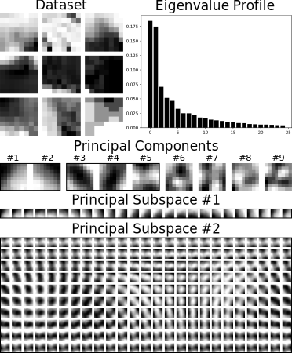

# principal-subspace-analysis

Authors' implementation of [_The curse of isotropy: from principal components to principal subspaces_](https://arxiv.org/abs/2307.15348).




## Significance statement

Principal component analysis is a ubiquitous tool in exploratory data analysis. It is widely used by applied scientists for visualization and interpretability purposes.
We raise an important issue (the _curse of isotropy_) about the rotational-invariance of principal components with close eigenvalues.
We explicitly quantify what "close" means using the principle of parsimony.
We show on real data that the curse of isotropy is not a negligible phenomenon and that particular care should be taken in the interpretation of the associated principal components.
In this context, we propose to transition from fuzzy principal components to more-interpretable principal subspaces.


## Methodology

We recall the simple methodology of principal subspace analysis:
1) Eigendecomposition of the sample covariance matrix 
2) Block-averaging of the adjacent eigenvalues with small gaps 
3) Interpretation of the resulting principal subspaces via factor rotation or latent subspace sampling


## Typical pipeline

Consider a dataset of `n=500` `(8, 8)`-patches extracted from natural images of flowers, gathered in a data matrix `X` of shape `(500, 64)`.
We perform the eigenvalue decomposition of the sample covariance matrix and plot the eigenvalue profile.
```python
eigval, eigvec = evd(X)
plt.bar(np.arange(p)[:25], eigval[:25], color='k')
```
We notice that eigenvalues 1 and 2 are relatively close, as well as 3, 4 and 5. We are therefore tempted to fit a PSA model of type `(2, 3, 59)`.
We check that this PSA model is indeed better than the associated PPCA model `(1, 1, 1, 1, 1, 59)` via the computation of the Bayesian information criterion (BIC).
```python
bic_psa  = bic(( 2,   3,   59), eigval, n)
bic_ppca = bic((1,1,1,1,1, 59), eigval, n)
```
Finally, we explore the associated principal subspaces by uniform sampling.
The first principal subspace is 2D. We sample uniformly some unit components on the 2-sphere.
```python
fig, axes = plt.subplots(1, 25)
for ax, theta in zip(axes, np.linspace(0, 2 * np.pi, 25)):
    x, y = np.cos(theta), np.sin(theta)
    ax.imshow((x * eigvec[:, 0] + y * eigvec[:, 1]).reshape(patchsize, patchsize))
```
The second principal subspace is 3D. We sample uniformly some unit components on the 3-sphere.
```python
fig, axes = plt.subplots(10, 25)
for i, phi in enumerate(np.linspace(0, np.pi, 10)):
    for ax, theta in zip(axes[i], np.linspace(0, 2 * np.pi, 25)):
        x, y, z = np.sin(phi) * np.cos(theta), np.sin(phi) * np.sin(theta), np.cos(phi)
        ax.imshow((x * eigvec[:, 2] + y * eigvec[:, 3] + z * eigvec[:, 4]).reshape(patchsize, patchsize))
```
We notice the emergence of low-frequency feature subspaces with rotational invariance.


## Remarks

- Many details about the methodology are provided in the **Supplementary Information (SI) Appendix** (notably some alternative model selection methods). 
- In high dimensions, the classical trick of *covariance regularization* might be a good idea to prevent from small positive or null eigenvalues.
Indeed, such eigenvalues can yield large relative eigengaps and cause automatic model selection methods to give poor results. 
You can use for instance the following script:
    ```python
    S = 1 / n * ((X - mu).T @ (X - mu))
    S += 1e-5 * np.trace(S) * np.eye(p)
    ```
- Eventually, trying some model types by hand based on the eigenvalue profile 
and computing the associated BIC or AIC seems for now to be the most universal model selection heuristic. 


## Data

Datasets for the _Natural Image Patches_ and _Eigenfaces_ experiments were downloaded from 
the [UCI Machine Learning Repository](https://archive.ics.uci.edu/) and from [Kaggle](https://www.kaggle.com/). 
The SI Appendix details how to get them. You can run the other experiments without downloading any external data.


## Installation

You can create a conda environment and then install the required packages by running the following commands on the Anaconda prompt.
```python
conda create -n principal-subspace-analysis python=3.9
pip install -r requirements.txt
```


## Citation

```bibtex
@misc{szwagier_curse_2024,
      title={The curse of isotropy: from principal components to principal subspaces}, 
      author={Tom Szwagier and Xavier Pennec},
      year={2024},
      eprint={2307.15348},
      archivePrefix={arXiv},
      primaryClass={stat.ME},
      url={https://arxiv.org/abs/2307.15348},
      doi = {10.48550/arXiv.2307.15348},
      keywords = {Principal Component Analysis, Isotropy, Interpretability, Parsimonious Models, Flag Manifolds},
}
```
